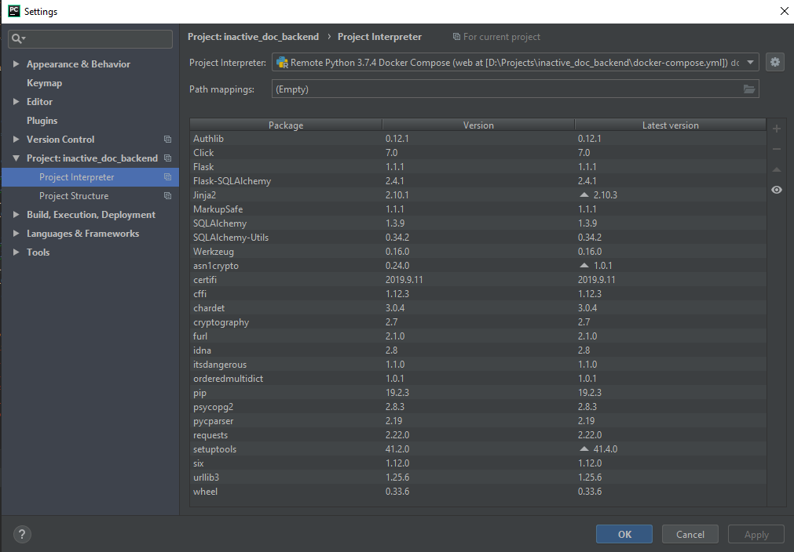
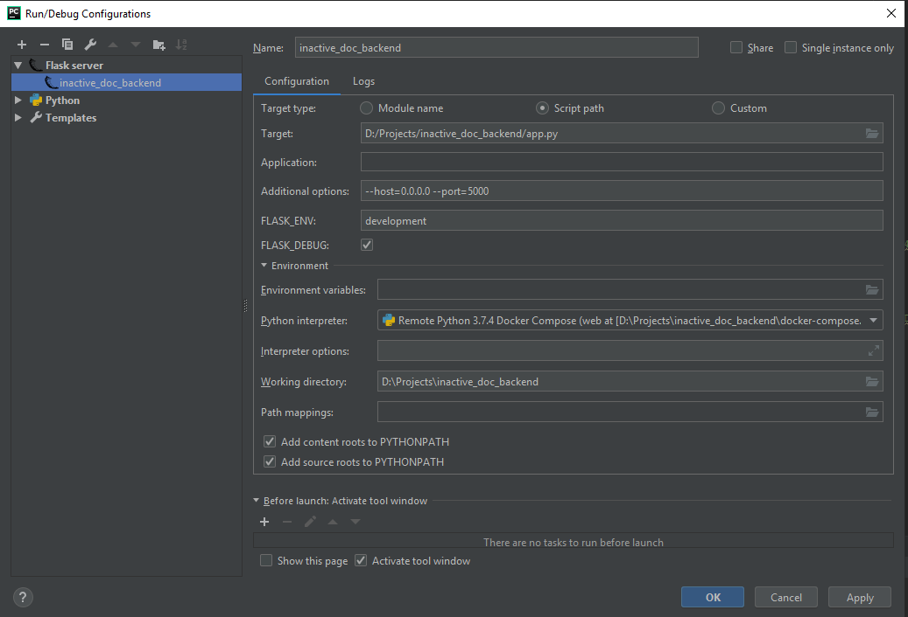

Configurate flask project:

add an interpreter in pycharm:  
  
  
å
after interpreter you could configure flask project  

  

now you able to start flask in debug mode

---

or just start `docker-compose up`